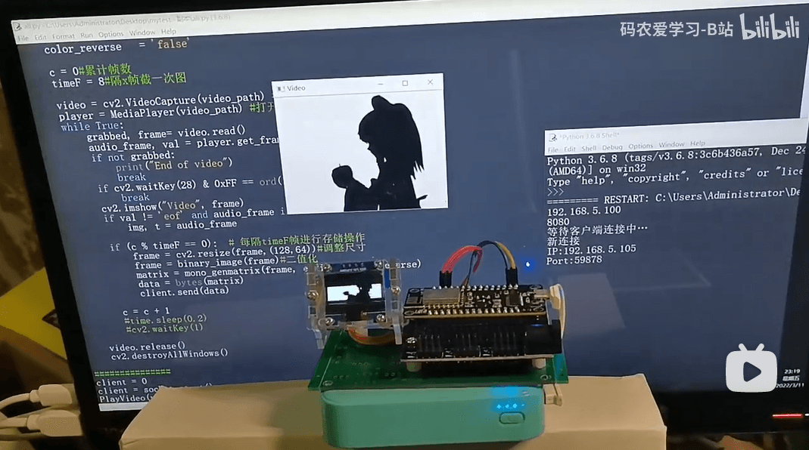

# ESP8266连网播放视频

ESP8266+OLED播放视频测试

- 电脑端Python程序作为视频数据的服务器，借助OpenCV实时读取视频帧，并进行二值图像转换，尺寸调整，再将二值图像转为数组，并以二进制形式的数据通过socket方式无线发送给ESP8266。Python程序中的ffpyplayer仅用于播放音频。
- ESP8266采用Arduino IDE编程，借助U8g2库，将图像数据实时显示到OLED屏幕中。

演示视频：

<https://www.bilibili.com/video/BV11S4y1S7ir>

