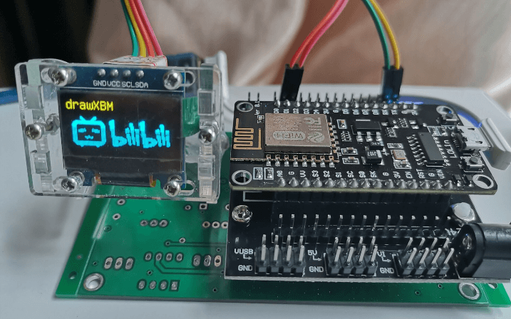
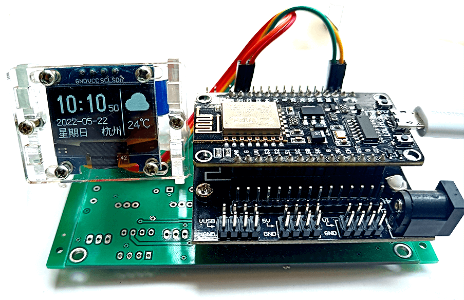
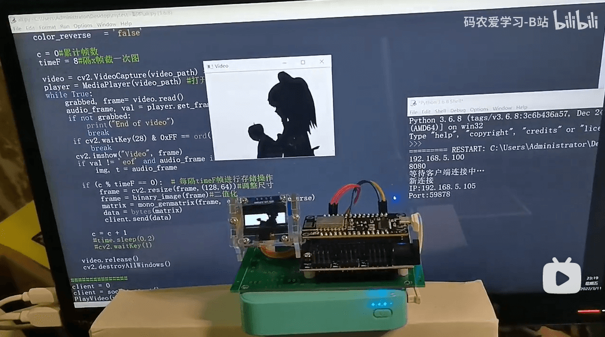

## ESP8266-Arduino实例

### 项目介绍
ESP8266实例小项目，Arduino IDE开发环境

### 项目结构

#### [01-ESP8266基础测试](01-ESP8266基础测试)

ESP8266 WiFi连网测试

#### [02-U8g2库基础测试](02-U8g2库基础测试)

0.96寸OLED-IIC接口，基础显示功能测试

#### [03-U8g2库各种图形函数测试](03-U8g2库各种图形函数测试)

测试U8g2库的各种画图函数，视频演示地址：

<https://www.bilibili.com/video/BV1om4y1R7nW>

#### [04-ESP8266简易WIFI天气时钟](04-ESP8266简易WIFI天气时钟)

测试ESP8266连网获取时间和天气，并在OLED上展示，视频演示地址：

<https://www.bilibili.com/video/BV1Ea411E7nk>

#### [05-ESP8266连网播放视频](05-ESP8266连网播放视频)

测试ESP8266连网播放视频，并在OLED上展示，视频演示地址：

<https://www.bilibili.com/video/BV11S4y1S7ir>

#### 06-ESP8266...

未完待续...

### 推荐学习

- B站相关视频：<https://space.bilibili.com/146899653>
- 个人博客：<https://xxpcb.gitee.io> ,   <https://xxpcb.github.io>
- 知乎：<https://www.zhihu.com/people/xxpcb>
- CSDN：<https://blog.csdn.net/hbsyaaa>
相互学习，共同进步~

